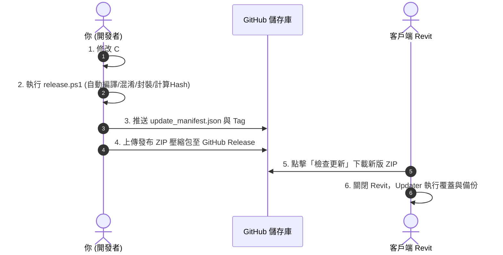

# Revit 整合型外掛系統框架 - Development tools (v3)

本系統是一套專為 Revit 設計的**整合式外掛平台框架 (Modular Add-in Platform Framework)**，命名為 **「Development tools」**。
透過單一的 DLL 核心與統一的 Google Sheets 雲端資料庫，可實現精準的使用者授權、時長統計、即時反饋，並支援動態插拔與熱更新多種子外掛（如磁磚、粉刷、樓板、圖紙、標註等工具）。

---

## 🛠️ Revit 介面架構與按鈕詳解（含新手使用教學）

安裝後，Revit 上方會出現名為 **「Development tools」** 的 Ribbon 頁籤，底下劃分為六個面板。每個按鈕皆內建雙層次（快速指南與專家原理解析）懸停提示。

### ▍ 面板一：【系統管理】
管理使用者登入狀態、意見反饋與系統升級。

| 按鈕名稱 | 執行指令 | 新手使用教學 (快速指南) | 進階/原理解析 |
| :--- | :--- | :--- | :--- |
| **🔑 Google 登入** | `LoginCommand` | 1. 點擊按鈕，會自動開啟網頁瀏覽器。<br>2. 登入 Google 帳號進行權限認證。<br>3. 認證成功後回到 Revit，各功能即解鎖。 | 採用 OAuth 2.0 協議，不收集任何密碼。系統會實時與雲端白名單比對以控制模組開通，新帳號會自動註冊並預設啟用 `Tiling`。 |
| **💬 問題與反饋** | `FeedbackCommand` | 1. 點擊打開問題回報視窗。<br>2. 輸入錯誤描述、建議或貼上截圖網址。<br>3. 點擊「提交」即可傳送。 | 反饋內容會直連 Apps Script 並寫入雲端 Excel，系統會同步採集當前使用者資訊與時間，以利開發小組排查。 |
| **🔄 檢查更新** | `CheckUpdateCommand` | 1. 點擊按鈕，系統會線上檢查是否有新版本。<br>2. 若有新版，會彈出視窗顯示更新明細內容。<br>3. 點選「確認安裝」後重啟 Revit 完成升級。 | 系統在每次開啟工具時也會進行背景靜默檢測。更新包下載後會進行 SHA256 強雜湊校驗，並透過獨立的 Updater 進行覆蓋與 Rollback 備援。 |

---

### ▍ 面板二：【空間排版】
提供磁磚自動化鋪設、精確統計與立面展開圖無縫對接排版。

| 按鈕名稱 | 執行指令 | 新手使用教學 (快速指南) | 進階/原理解析 |
| :--- | :--- | :--- | :--- |
| **🧱 磁磚鋪設系統** | `ShowControlPanelCommand` | 1. 點擊開啟磁磚設計浮動面板。<br>2. 點選房間 (Room)，設定磁磚規格與起磚偏移量。<br>3. **[步驟 1] 生成網格**：點選目標牆面/地板繪製臨時預覽線。<br>4. **[步驟 2] 確認改寫**：改寫表面前景填充線固化圖案。<br>5. **[步驟 3] 建立牆/地磚**：長出 3D 原生實體磁磚。 | 內建 DMU (Dynamic Model Update) 機制，當房間牆體拖動時，磁磚會動態重算。<br>支援局部材質替換與轉換為可編輯 Wall/Floor 進行輪廓修剪。<br>提供平面/3D 實體統計估算，可一鍵產生明細表或匯出 Excel。 |
| **📐 展開圖生成** | `DT_TileElevationGeneratorCommand` | 1. 點擊開啟面板，預選或多選地板 (Floor) 或牆體。<br>2. 點選「1. 分析幾何」提取邊界。<br>3. 依序執行建立視圖、套用樣板、命名。<br>4. 點選「5. 建立圖紙並置入」，視圖會在圖紙上自動水平對齊並無縫排開。<br>*(亦可直接點擊「🚀 一鍵自動產生」)* | **無高低差對齊技術**：讀取牆底標高高程，在圖紙放置 Viewport 時扣除高差偏移，使樓板線在一條水平線上。<br>**無縫拼接**：置入圖紙時先暫時隱藏軸線、標高等註解以獲取純淨 CropBox，無縫排開後再恢復註解。 |

---

### ▍ 面板三：【粉刷裝修】
提供房間粉刷層實體自動化建立與裝修參數批次配置。

| 按鈕名稱 | 執行指令 | 新手使用教學 (快速指南) | 進階/原理解析 |
| :--- | :--- | :--- | :--- |
| **🧱 自動粉刷** | `WallFinishCommand` | 1. 點擊進入選取模式。<br>2. 在視圖中點選一個或多個目標房間 (Room)。<br>3. 程式會分析房間牆面範圍，自動長出特定厚度與材質（如水泥砂漿）的粉刷薄牆。 | 自動讀取房間 Finish 邊界。內建**門窗洞口扣減機制**，能精確提取牆上門窗的物理洞口形狀，在生成的粉刷牆上進行開口裁剪，保證工程量精準。 |
| **🏠 房間裝修配置** | `Cmd_RoomFinishConfigurator` | 1. 點擊按鈕開啟配置清單，檢視所有有效房間。<br>2. 可直接在格子中編輯各房間的地板、牆面與天花板裝修欄位。<br>3. 可利用左側面板批量填入裝修規格。<br>4. 點擊「確定更新」寫回 Revit。 | 讀寫 Room 元件的 Base Finish、Wall Finish 與 Ceiling Finish 屬性。此配置可作為自動粉刷與排磚系統在生成時的材質規格讀取依據。 |

---

### ▍ 面板四：【樓板工具】
提供樓板邊界與牆面完成面的自動吸附與拓撲修正。

| 按鈕名稱 | 執行指令 | 新手使用教學 (快速指南) | 進階/原理解析 |
| :--- | :--- | :--- | :--- |
| **📐 樓板貼房間** | `Cmd_FloorSnapToRoom` | 1. 預選樓板，或點按鈕後框選（需於 Options Bar 點擊「完成 (Finish)」）。<br>2. 程式自動搜尋同樓層對應房間並獲取完成面邊界。<br>3. 樓板草圖線段會自動吸附貼齊房間邊緣並修剪拐角。 | **草圖閉合保證**：針對 MaxSnapDistance (300mm) 內的平行線進行投影對齊，並對相鄰線重新計算 2D 延伸交點。圓弧保持曲率僅微調端點。<br>**防崩潰機制**：每塊樓板使用獨立 TransactionGroup，單一樓板失敗會獨立 Rollback 並報告，不影響其他成功樓板。 |

---

### ▍ 面板五：【圖紙工具】
提供圖紙批次更名管理與多視圖樣板快速套用出圖。

| 按鈕名稱 | 執行指令 | 新手使用教學 (快速指南) | 進階/原理解析 |
| :--- | :--- | :--- | :--- |
| **🏷️ 圖紙批次更名** | `Cmd_BatchSheetRenamer` | 1. 點擊按鈕開啟清單視窗。<br>2. 可直接編輯清單中的圖紙編號與名稱。<br>3. 支援即時搜尋篩選、批量尋找/取代、加前後綴與流水號遞增。<br>4. 點擊「確定更新」套用。 | **衝突防護機制**：為避免 Revit 要求圖紙編號唯一的限制，在對調編號時（如 A01->A02，A02->A01），外掛採用「兩步暫存修改法」，先加上 Temp 後綴再改為目標值，完美避開報錯。 |
| **📂 快速開圖套樣板** | `Cmd_QuickViewCreator` | 1. 點擊按鈕開啟開圖視窗。<br>2. 左側勾選多張來源平面圖，右側勾選多個視圖樣板。<br>3. 選擇複製模式，可勾選「自動建立圖紙並置入」。<br>4. 點擊「一鍵開圖」即可完成批次建置。 | 支援複製結構、複製詳圖與建立相依三種複製模式。新視圖以「原圖-樣板」命名，遇衝突會遞增後綴 (_1, _2)。若勾選建立圖紙，會自動生成圖紙並將新視圖放置於圖紙正中央。 |
| **📊 圖紙視圖排版** | `Cmd_SheetViewPlacer` | 1. 點擊按鈕開啟排版視窗。<br>2. 展開左側的「未放置視圖」列表。<br>3. 用滑鼠將視圖拖放 (Drag & Drop) 到目標圖紙上即可置入。<br>4. 可在不同圖紙間拖曳視圖以調整移轉，或點選「新建圖紙」一鍵加開圖紙。 | **智能跨圖紙移轉**：在後台自動刪除舊圖紙的 Viewport 並在新圖紙上建立，避開 Revit 單一視圖限置單一圖紙的限制。<br>**防重疊偏移**：若圖紙已有視窗，自動套用微幅偏移。<br>支援選取圖框、更換視埠類型與明細表拖放。 |

---

### ▍ 面板六：【標註工具】
提供多種對齊模式的快速連續尺寸標註。

| 按鈕名稱 | 執行指令 | 新手使用教學 (快速指南) | 進階/原理解析 |
| :--- | :--- | :--- | :--- |
| **📏 快速尺寸標註** | `Cmd_QuickDimension` | 1. 點擊按鈕開啟 Modeless 控制面板。<br>2. 選擇標註模式（柱中心、牆中心、開口邊到邊）、樣式與偏移距離。<br>3. 點擊「開始選取並標註」，在視圖中點選目標元件，按 Esc 完成。 | **柱中心**：自動提取結構柱/建築柱內部的 Center 幾何面參照並生成標註。<br>**牆中心**：藉由牆體定位中心線 Reference 建立連續對齊標註。<br>**開口邊到邊**：讀取門窗元件內部的 Left/Right 強參照面，快速標註淨寬與間距。 |

---

## 🚀 新手快速安裝指南 (3 分鐘上手)

本外掛全面支援當前使用者免管理員權限 (Per-User) 部署，安裝時**完全不需要輸入系統管理員 UAC 密碼**，並完美相容 **Revit 2024、2025、2026**。

### 📌 方式一：綠色免安裝一鍵部署 (推薦)
1. 從 GitHub Release 下載最新的綠色免安裝包 **`DevelopmentTools_v{Version}.zip`** (如 `DevelopmentTools_v1.0.0.zip`)。
2. **【📢 重要】**：請務必先將壓縮包**完整解壓縮**，切勿在壓縮檔內部直接執行！
3. 進入解壓縮後的資料夾，雙擊執行 **`install.bat`**。
4. 提示安裝成功後按任意鍵關閉即可。

### 📌 方式二：安裝包安裝 (EXE)
1. 下載並雙擊執行 **`DevelopmentTools_Setup.exe`**。
2. 本安裝程式已調整為最低權限要求 (Lowest Privilege)，直接點選下一步即可安裝完成。

---

### 📌 首次啟動 Revit 載入與登入
1. 打開您的 **Revit 2024、2025 或 2026**。
2. 首次安裝時，Revit 會彈出安全提示：`安全警告 - 未簽署的外掛`。請點選 **`永遠載入 (Always Load)`**。
3. 點選 Revit 上方 `Development tools` 頁籤中的任何功能，會自動打開瀏覽器引導進行 Google 帳號授權驗證。
4. 驗證成功後即可開始使用。新帳號會自動註冊於雲端並開通磁磚系統權限。

---

## 🔄 雲端同步與新版本發布指南 (開發者手冊)

本系統支援「無感自動更新」機制，開發者在本地完成開發後，可透過一鍵腳本同步發布至雲端。

### 1. 發布流程示意圖


### 2. 執行一鍵發布指令
在專案根目錄開啟 PowerShell，執行以下指令（以發布 `1.0.0` 版為例）：
```powershell
powershell -File .\release\release.ps1 -Version 1.0.0
```
**該腳本會自動完成以下工作：**
1. 在 Release 模式下進行專案建置。
2. 自動呼叫 `Obfuscar` 對 `DevelopmentTools.Addin.dll` 進行代碼混淆與字串加密。
3. 將混淆後的 DLL、依賴項、設定檔及 Updater 壓縮打包為 `dist\DevelopmentTools_v1.0.0.zip`。
4. 計算該 ZIP 的 SHA256 哈希值，並產生/更新根目錄下的 `update_manifest.json`（寫入下載連結、版號與 Hash）。
5. 提交並推送 `update_manifest.json` 到 GitHub。
6. 建立 Git Tag `v1.0.0` 並推送到 GitHub。
7. 嘗試呼叫 GitHub CLI (`gh`) 自動建立 Release 並上傳 ZIP。*(若無安裝 gh CLI，請手動至 GitHub 專案頁面建立 `v1.0.0` Release 並上傳 `dist\DevelopmentTools_v1.0.0.zip`)*

---

## 🔑 雲端管理與授權設定 (Google Sheets + Apps Script)

### 1. 試算表 `Users` 欄位設計
您的 Google 試算表中，`Users` 工作表應包含以下標題（系統會自動定位欄位）：

| 欄位名稱 | 說明 | 範例值 |
| :--- | :--- | :--- |
| **Email** | 使用者的 Google 帳號 | `user@gmail.com` |
| **Status** | 啟用狀態（Allowed = 啟用 / Blocked = 封鎖） | `Allowed` |
| **AllowedTools** | 授權的子工具 ID (半形逗號分隔，如 `Tiling,WallFinish,FloorSnapToRoom`) | `Tiling,WallFinish` |
| **RegisterTime** | 首次自動註冊時間 | `2026-05-31...` |
| **LastActiveTime** | 最後活動時間 | `2026-05-31...` |
| **UsageCount** | 累計點擊使用次數 | `15` |
| **TotalDurationMinutes** | 累計在 Revit 中的開啟使用時長 (分鐘) | `45.5` |

### 2. 雲端 Apps Script 部署
1. 複製本機 [google_apps_script.js](file:///d:/Room%20Tile%20Local%203%20System/DevelopmentTools.Addin/google_apps_script.js) 的完整程式碼。
2. 貼入試算表中的 **「擴充功能 > Apps Script」** 並儲存。
3. 點擊右上角 **「部署 > 新增部署」**，類型選擇「網頁應用程式」，將存取權限設為 **「所有人」** (Anyone)。
4. 複製產生的 Web App URL，填入 `platform_config.json` 的 `GoogleSheetApiUrl` 中。

---

## 💻 本地離線測試模擬器
在沒有網路連線或不想影響雲端資料庫時，可使用本地模擬伺服器 [mock_auth_server.py](file:///d:/Room%20Tile%20Local%203%20System/mock_auth_server.py)：
1. 將 `platform_config.json` 的 `GoogleSheetApiUrl` 改為 `"http://localhost:8080/"`。
2. 在終端機執行 `python mock_auth_server.py`。
3. 開啟 Revit，即可透過以下預設帳號模擬授權情境：
   - `dimadima5953@gmail.com`：僅擁有 `Tiling` 磁磚系統權限。
   - `admin@example.com`：擁有所有工具權限。
   - `blocked_user@example.com`：全域停用帳號。
